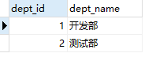
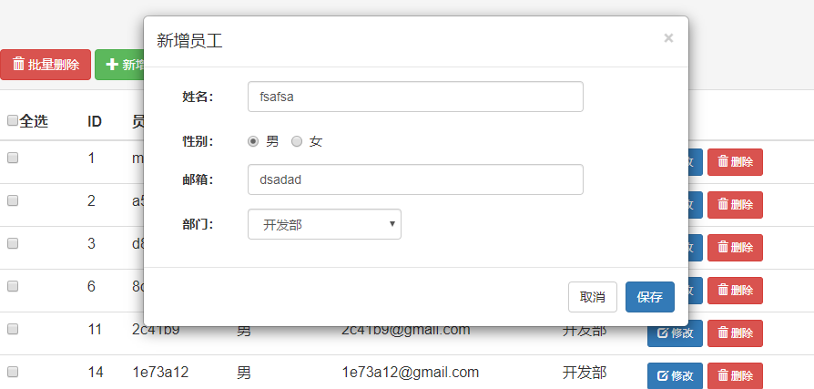

# SSM_CRUD

## 项目环境

> + JDK 1.8
> + Tomcat 8
> + Mysql 5.7.24
> + Sping 4.3.18.RELEASE

## 项目使用

有需要的朋友如下操作：

1. 克隆项目到本地

2. IDEA 导入项目

   1. 数据库生成，先创建数据库 `ssmcrud`，修改 `dbConfig.properties` 文件中的`username` 、`password`, 再

   + 使用 sql/ssmcrud.sql 文件生成，含有结构和数据

   + 1. 使用 sql/ssmcrud_without_datas.sql 文件生成结构,数据使用 src/main/java/.../test/MapperTest#testCRUD()方法，去掉批量生成处的注释，执行即可生成表数据。

     2. 生成 部门表，很少的数据，自己插入吧。如下：

        

## 技术知识点

+ 基础框架 SSM
+ 数据库 MySQL
+ 前端框架 Bootstrap
+ 项目依赖管理 Maven
+ 分页 PageHelper
+ 逆向工程 Mybatis Generator
+ JSR303 校验 Hibernate Validate 
+ REST 请求

## 过程

### 创建 Maven 项目及配置环境

1. 使用 IDEA 创建新的 Maven 项目
2. 在 Facets 中添加webapp目录。添上web.xml文件
3. 更改Maven的设置，设置阿里云镜像（<mirrors>），jdk 编译版本（<profile>）。
4. pom 中引入 jar 包
   + ssm
   + 数据库连接驱动、连接池
   + 其他（JSTL、servlet-api、junit）
5. 引入 Bootstrap 前端框架，在页面引入 JQuery、Bootstrap
6. SSM 整合配置编写（web.xml、applicationContext-*.xml）
7. 配置数据源时，写上 dbconfig.proprties，并创建数据库 ssmcrud

### Myabatis Generator生成bean、dao接口、mapper文件

使用Mybatis逆向工程生成bean、dao、mapper

### 修改bean、dao和mapper等

修改bean、dao、mapper实现多表查询时，查询完整字段

涉及 association、collection

### Spring单元测试：Mapper测试

对mapper的基本测试

```java
@RunWith(SpringJUnit4ClassRunner.class)
@ContextConfiguration(locations = {"classpath:spring/applicationContext.xml"})
public class MapperTest {

    @Autowired
    DepartmentMapper departmentMapper;
    /**
     * 测试DepartmentMapper
     */
    @Test
    public void testCRUD(){
        System.out.println(departmentMapper.toString());

    }
}
```

实现批量操作：

1. 在IOC中创建sqlSession的bean，保证每次操作是同一个sqlSession（否则就是用sqlSessionFactory创建的）。

   ``` xml
   <!--实现批量操作的 sqlSession-->
   <bean id="sqlSession" class="org.mybatis.spring.SqlSessionTemplate">
       <constructor-arg name="sqlSessionFactory" ref="sqlSessionFactory" />
       <constructor-arg name="executorType" value="BATCH" />
   </bean>
   ```

2. 批量操作（如insert）

   ```java
   // 批量插入
   for (int i = 0; i < 1000; i++) {
       EmployeeMapper mapper = sqlSession.getMapper(EmployeeMapper.class);
       String gender = Math.random()> 0.5 ? "F" : "M";
       String name = UUID.randomUUID().toString().substring(0,5) + i;
       Integer deptId = Math.random() > 0.5 ? 1 :2;
       mapper.insertSelective(new Employee(null,name,gender,name+"@gmail.com",deptId));
   
   }
   ```

到此为止，数据库已连通，可以实现业务逻辑了！:happy: :call_me_hand:


### **接口约定**

| 接口               | 参数                          | 说明                                       |
| ------------------ | :---------------------------- | :----------------------------------------- |
| /emps              | pageNo:要查询的页码           | 员工列表(分页查询)，Json数据，封装返回结果 |
| /emp/{id}  GET     | id:Integer                    | 按id查询员工                               |
| /emp  POST         |                               | 新增员工                                   |
| /emp/{id}  PUT     | e:Employee                    | 修改员工信息                               |
| /emp/{ids}  DELETE | ids:String，多个id则以'-'隔开 | 删除员工信息                               |
| /checkuser         | empName:String,待检查的姓名   | 新增或修改用户信息时，检查username是否可用 |
| /depts             |                               | 所有部门信息，封装结果                     |

### 查询员工

编写员工列表页面 list.jsp

使用PageHelper分页

1. Maven 引入pagehelper

2. Mybatis 配置中注入 Plugin 

   ```xml
   <plugins>
       <plugin interceptor="com.github.pagehelper.PageInterceptor">
           <!--配置此项使访问大于最大页码或小于最小页码的时候，改变为访问1、max-->
           <property name="reasonable" value="true" />
       </plugin>
   </plugins>
   ```

3. 使用

   ```java 
   // 使用PageHelper
   PageHelper.startPage(pageNo,10);
   // 查询
   List<Employee> employeeList = employeeService.getAll();
   // 返回PageInfo即可
   PageInfo info = new PageInfo(employeeList);
   model.addAttribute("page",info);
   ```

4. MVC单元测试

   ```java
   package com.cantfu.crud.test;
   
   import com.cantfu.crud.bean.Employee;
   import com.github.pagehelper.PageInfo;
   import org.junit.Before;
   import org.junit.Test;
   import org.junit.runner.RunWith;
   import org.springframework.beans.factory.annotation.Autowired;
   import org.springframework.test.context.ContextConfiguration;
   import org.springframework.test.context.junit4.SpringJUnit4ClassRunner;
   import org.springframework.test.context.web.WebAppConfiguration;
   import org.springframework.test.web.servlet.MockMvc;
   import org.springframework.test.web.servlet.MvcResult;
   import org.springframework.test.web.servlet.request.MockMvcRequestBuilders;
   import org.springframework.test.web.servlet.setup.MockMvcBuilders;
   import org.springframework.web.context.WebApplicationContext;
   
   import java.util.List;
   
   /**
    * MvcTest
    * 测试 WEB 请求
    * @author cantfu
    */
   @RunWith(SpringJUnit4ClassRunner.class)
   @WebAppConfiguration
   @ContextConfiguration(locations = {"classpath:spring/applicationContext.xml"})
   public class MvcTest {
   
       /**
        * 虚拟 MVC 请求,获取处理结果
        */
       MockMvc mockMvc;
   
       @Autowired
       WebApplicationContext webApplicationContext;
   
       @Before
       public void init(){
           mockMvc = MockMvcBuilders.webAppContextSetup(webApplicationContext).build();
       }
   
       @Test
       public void pageTest() throws Exception{
           // 拿到请求结果
           MvcResult result = mockMvc.perform(MockMvcRequestBuilders.get("/emps").param("pageNo", "1")).andReturn();
           // 用page信息校验
           PageInfo page = (PageInfo) result.getRequest().getAttribute("page");
           System.out.println("当前页码：" + page.getPageNum());
           System.out.println("总页码：" + page.getPages());
           System.out.println("总记录数：" + page.getTotal());
           System.out.println("页面需要显示的导航页码号：");
           int[] navigatePages = page.getNavigatepageNums();
           for (int i : navigatePages) {
               System.out.print(" " + i);
           }
           // 获取员工信息
           List<Employee> emps = page.getList();
           for (Employee emp : emps) {
               System.out.println("ID:" + emp.getEmpId() + "--------NAME:" + emp.getEmpName());
           }
       }
   }
   ```

5. 写list页面，详见list2.jsp.(JSP)

   细节：

   1. web路径最好写成以"/" 开头，此方式会使用服务器的路径(没带项目名)，因此在页面前面获取出 context 的路径，即可在资源路径中不用写死。
   2. 注意处理分页导航中的各个参数。注意首页和末页时，没有前页和后页链接。使用 jstl 的 c 标签，使用PageInfo的各参数,navigatepageNums、pageNum、pages、total。详见PageInfo.java。


目前为止，实现了**基本查询**功能，带有**分页**。效果如下：


6. 改造成为 Ajax 的 Json 数据格式。详见 index.jsp（Ajax）
   + 加上 @ResponsBody ,添加 jackon-databind 包
   + 注意若出现 找不到类的情况，先看看Artifacts中的新加入的包是否成功导入
   + 封装返回结果，添加上状态码，链式操作添加数据。（记得需要转为json的都需要）
   + 

### 新增员工

1. 编写新增模态框页面元素，进入时查询部门信息（/depts），注入到下拉框。每次进入要reset输入框的值

2. 编写查询部门api（动态显示所有部门）、新增接口 api

3. 页面处理返回结果

   显示结果，隐藏模态框，转到最后一页。

4. 中间添加校验步骤。前端校验、后端 JSR303 校验，校验后才保存。

   校验格式是否正确、校验姓名是否已存在。

   后端校验 Hibernate Validate，Tomcat7 以下需将服务器的 el 包替换为新的 el 包。JSR303 使用：在Controller参数使用@Valid 和BindingResult

模态框如下所示：



### 修改员工

1. 点击修改按钮，弹出模态框。此处要事件绑定。

   + 可在修改按钮创建时绑定事件；

   + JQuery 的 on() 方法；

     ```js
     $("#emps_table").on("click",".update-btn",function(){
       alert("I'm be clicked");
     });
     ```

2. 清空模态框的上次内容。查出员工信息，查出部门信息，显示在模态框中

   + 查询员工使用id，此id 可在 表格每条数据创建时 自定义属性来保存。

   + 发送更新请求时也需要 id ，也可传递到更新按钮 中的属性去。

   + 前端发送 PUT 请求的两种方法：

     + 1.需要发送 POST 方法，带上 _method 参数为 PUT。发送数据中不用带上 id，id在 url 路径中保存，只要路径参数名和Employee 对象的字段名一样即可自动转换。如 :

       ```java
       $.ajax({
           ......
           type: 'POST',
           data: $("#update_emp_modal form").serialize()+"&_method=PUT",
           success: function (result) {
               alert("处理成功！");
           },
           ......
       });
       
       
       @ResponseBody
       @RequestMapping(value = "/emp/{empId}", method = RequestMethod.PUT)
       public ResultMsg updateEmp(Employee e){
           System.out.println(e);
           Integer updateRow = employeeService.updateEmp(e);
           return ResultMsg.success().add("updateRow",updateRow);
       }
       ```

     + 2.注意：直接用 Ajax 的 PUT 请求会出现能把数据带到请求中，但是后端接收为 null 的情况。因为 Tomcat 是使用 request.getParameter() 获取值放到 map 中的（org.apache.catalina.connector.Request#parseParameters()），而 Tomcat 不会封装 PUT 请求的值,只有“POST” 请求才会解析。详情见Tomcat源码，parseBodyMethodsSet 没有 PUT. 默认parseBodyMethods="POST"。

       解决办法：

       web.xml 中配置 HttpPutFormContentFilter 过滤器。(原理：自定义了 request 对象，重写了 getParameter()方法，SpringMVC 获取时就从此 request 中取值。也就是只做了解析数据的作用)

       ``` xml
       <filter>
           <filter-name>httpPutFormContentFilter</filter-name>
           <filter-class>org.springframework.web.filter.HttpPutFormContentFilter</filter-class>
       </filter>
       <filter-mapping>
           <filter-name>httpPutFormContentFilter</filter-name>
           <url-pattern>/*</url-pattern>
       </filter-mapping>
       ```

     此时的 Ajax 就不用发送 POST 请求和_method 参数，而直接发送 PUT 请求即可。

### 删除员工

#### 1.单个删除

+ 弹出确认框
+ 确认后删除员工
+ 结果响应，返回当前页

#### 2.批量删除

+ 全选、全不选功能

  Tips：使用$().prop("attrName") 获取dom原生属性。全选、全不选可同下面选中的个数与总个数比较得出。

  和单个删除的函数合并为一个，在路径参数的id 上，以短横线  ' - ' 隔开。

  ```java
  /**
   * 根据 id 删除员工,返回受影响的行数
   * @param id 多个id则以' - '隔开，eg: 1-2-3
   * @return
   */
  @ResponseBody
  @RequestMapping(value = "/emp/{ids}",method = RequestMethod.DELETE)
  public ResultMsg deleteEmp(@PathVariable("ids") String ids){
      // 单个删除
      if(ids.contains("-")){
          // TODO 异常处理
          Integer deleteRow = employeeService.deleteEmp(Integer.parseInt(ids));
          return ResultMsg.success().add("deleteRow", deleteRow);
      }
  
      // 批量删除
      String[] delete_ids = ids.split("-");
      HashSet<Integer> idSet = new HashSet<>(8);
      for (String id : delete_ids) {
  
          idSet.add(Integer.parseInt(id));
      }
      List<Integer> idList = new ArrayList<Integer>(idSet);
      Integer deleteRow = employeeService.deleteBatchEmp(idList);
      return ResultMsg.success().add("deleteRow",deleteRow);
  }
  ```

### 小坑总结

1. JQuery 用 on 为生成的元素绑定事件。如下，`#emps_table_body`为祖先元素，`.delete-btn`为要绑定的元素。

   ```js
    // 为删除按钮绑定事件
   $("#emps_table_body").on("click",".delete-btn",function () {
       var empName = $(this).parent().parent().find("td").eq(2).text();
       // 1.弹出确认框
       if(!confirm("确认要删除员工 '"+empName+"' 的信息吗？")){
           return false;
       }
       ....
   }
   ```


## 总结


## 项目部署

1. 生成 sql 文件，包含结构与数据

2. 使用 maven install 在target 目录下生成 war包（ssm-crud.war）

3. 将 war 包放在服务器的 webapps 目录下

4. 进入命令行输入 mysql -u root -p,进入mysql 环境

5. 创建 ssmcrud 数据库：create database ssmcrud;

6. 生成数据，有两种方法。
   1. + 将 ssmcrud.sql 文件上传至某一目录下，如:/usr/local/
      + use ssmcrud;
      + source /usr/local/sql/ssmcrud.sql;
   2. 利用navicat 远程连接，需要开启服务器的3306端口。创建数据库ssmcrud,打开改数据库,直接将sql文件拖入运行即可。

7. 重启Tomcat。
   + 进入 Tomcat 的 bin 目录
   + 执行 ./shutdown.sh
   + 执行 ./startup.sh

8. 通过 IP:prot/ssm-crud 即可访问. 404了？？？？？

   查看 catalina.log 日志，发现 异常：Caused by: java.lang.ClassNotFoundException: javax.el.ELManager。

   

   应该是 el 包版本低的原因，服务器是 Tomcat 7,下载 javax.el-api-3.0.0.jar 包（3.0版）,替换原有 jar 包（el-api.jar）。--------此方法不行。

   **替换Tomcat 7 为 Tomcat 8**，运行成功，可以访问。


## Vue 版本

用JQuery 太臃肿了，疯狂操作 DOM ，考虑使用 Vue.js 来优化。

后端采用的 Restful 风格 接口，只需更改前端即可。

### 技术路线

Vue2 + axios + Element + webpack  

写完发布到 Nginx 即可。

注：后端要配合跨域修改，关键点 `@CrossOrigin`.